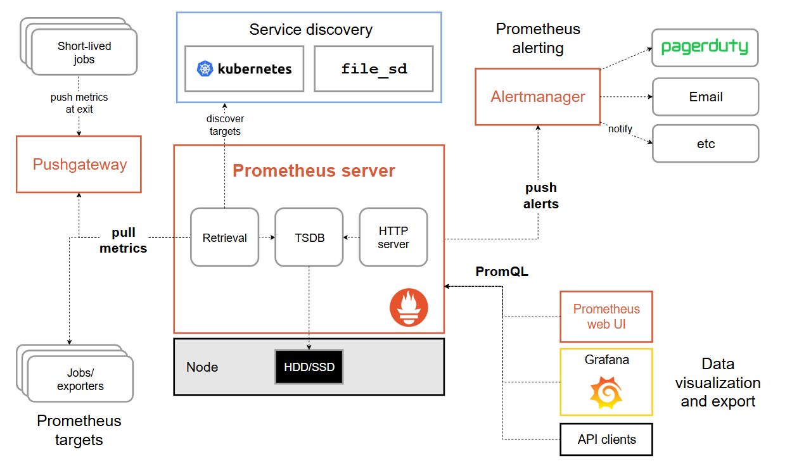
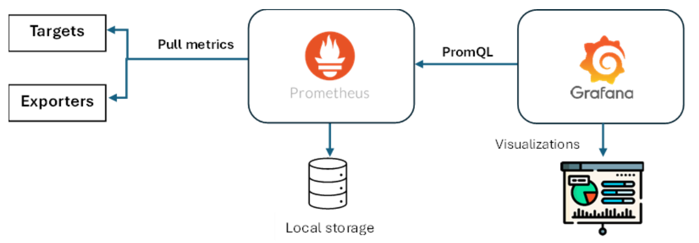
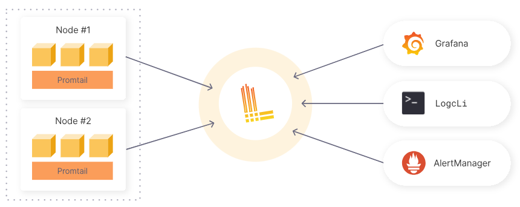
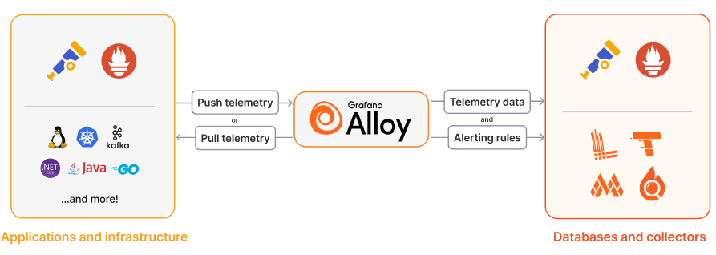

# Cloud Monitoring Documentation
<b>Abstract:</b>

Observability is a crucial process of monitoring our Infra and the workload. Having a holistic view of your infrastructure is not an option anymore but a necessity, especially for monitoring the performance and availability of critical systems that might lead to catastrophic impacts if anything goes wrong for some reason. Having a reliable tool for that purpose remains an essential factor for a smooth operation pace. A monitoring stack composed of opensource tools (Prometheus, Node Exporter, and Grafana) was leveraged to collect, store, and visualize metrics from a Linux server in real time. Grafana dashboard was found to provide detailed insights into the monitored infrastructure in a very intuitive way.

## Introduction
Monitoring is a very crucial process in the modern IT lifecycle and is not an option anymore, especially with the increasing cyber-attacks and performance-challenging incidents. Adopting the CIA triad (confidentiality, integrity, and availability) mandates the availability of data, resources, or infrastructure to the authorized entities, which requires monitoring to ensure a reliable secure environment. Having a holistic view about current performance indicators is a game-changer for assessing past, current and predicting future systems’ outcome. Monitoring IT assets in real-time requires a reliable monitoring system that collects and provides intuitive information within small to extended networks to guarantee a smooth operation without disruption. 

Having insightful data visualizations greatly influence the observability capabilities required to have a clear view about what’s going on, what needs to be adjusted and what needs to be checked and enhanced. That merely relies on collecting precise metrics from end-devices in real-time or semi real-time to help efficient decision-making and avoid unavailability or downgraded performance. Observability in IT refers to the ability to understand the internal state of a system, primarily through three key pillars: logs, metrics, etc..

## Prometheus
Prometheus is an open-source systems monitoring toolkit. Prometheus collects and stores its metrics as time series data, i.e. metrics information is stored with the timestamp at which it was recorded, alongside optional key-value pairs called labels.

Prometheus's main features are:
* A multi-dimensional data model with time series data identified by metric name and key/value pairs
* PromQL, a flexible query language to leverage this dimensionality
* No reliance on distributed storage; single server nodes are autonomous
* Time series collection happens via a pull model over HTTP
* Pushing time series is supported via an intermediary gateway
* Targets are discovered via service discovery or static configuration
* Multiple modes of graphing and dashboarding support

### Prometheus Architecture
This diagram illustrates the architecture of Prometheus and some of its ecosystem components:

Components: 

The Prometheus ecosystem consists of multiple components, many of which are optional:
* The main Prometheus server which scrapes and stores time series data
* Client libraries for instrumenting application code
* A push gateway for supporting short-lived jobs
* Special-purpose exporters for services like HAProxy, StatsD, Graphite, etc.
* An alertmanager to handle alerts
* Various support tools

## Grafana 
Grafana Is an open-source tool that empowers the query, visualization, and analysis of metrics from various locations and data sources including Prometheus. The strength of Grafana is the ability to create intuitive dashboards involving time-based line, area, and bar charts. In addition to gauges, histograms, and heatmaps. Below are the different use cases of Grafana.

<b>Visualization of time-series data</b>

Grafana is highly effective in creating interactive dashboards for metrics collected.

<b>Monitoring infrastructure and applications’ performance</b>

It facilitates the monitoring of metrics like CPU and memory usage, including response time and error rates, by integrating with tools like Prometheus.

<b>Log analysis</b>

It can aggregate logs with metrics from systems like Elasticsearch and Loki.

<b>Alerting functions</b> 

Alert rules can be established to send notifications for critical events. 

<b>Capacity planning</b>

Analyzing historical metrics and providing predictions for optimal resource utilization and capacity planning.

## Grafana Loki

Loki is a horizontally scalable, highly available, multi-tenant log aggregation system inspired by Prometheus. It is designed to be very cost effective and easy to operate. It does not index the contents of the logs, but rather a set of labels for each log stream.

* It’s really easy to get started because you can send logs in any format, from any source, using a wide array of clients
* 100% persistence to object storage means you get petabyte scale, high throughput and cost-effective & durable storage
* Build metrics and generate alerts from your log lines
* No ingestion log formatting requirements gives you more flexibility and the option to format at query time
* Tail your logs in realtime to see the logs as they come into the system, update the logs after every certain time, view logs for a particular date, etc.
* Natively integrates with Prometheus, Grafana and K8s so you can seamlessly move between metrics, logs and traces within a single UI

<b>Pull in any logs with Promtail</b> 
Promtail is a logs collector built specifically for Loki. It uses the same service discovery as Prometheus and includes analogous features for labeling, transforming, and filtering logs before ingestion into Loki.

<b>Store the logs in Loki</b> 
Loki does not index the text of logs. Instead, entries are grouped into streams and indexed with labels.Not only does this reduce costs, it also means log lines are available to query within milliseconds of being received by Loki.

<b>Use LogQL to explore</b> 
Use Loki’s powerful query language, LogQL, to explore your logs. Run LogQL queries directly within Grafana to visualize your logs alongside other data sources, or with LogCLI, for those who prefer a command line experience.

<b>Alert on your logs</b> 
Set up alerting rules for Loki to evaluate on your incoming log data. Configure Loki to send the resulting alerts to a Prometheus Alertmanager so they can then get routed to the right team.

## Grafana Alloy
Grafana Alloy combines the strengths of the leading collectors into one place. Whether observing applications, infrastructure, or both, Grafana Alloy can collect, process, and export telemetry signals to scale and future-proof your observability approach.

<b>Collect all your telemetry with one product</b> 
Choosing the right tools to collect, process, and export telemetry data can be a confusing and costly experience. The broad range of telemetry you need to process and the collectors you choose can vary widely depending on your observability goals. In addition, you face the challenge of addressing the constantly evolving needs of your observability strategy. For example, you may initially only need application observability, but you then discover that you must add infrastructure observability. Many organizations manage and configure multiple collectors to address these challenges, introducing more complexity and potential errors in their obervability strategy.

<b>All signals, whether application, infrastructure, or both</b> 
Grafana Alloy has native pipelines for leading telemetry signals, such as Prometheus and OpenTelemetry, and databases such as Loki and Pyroscope. This permits logs, metrics, traces, and even mature support for profiling.

<b>Enterprise strength observability</b> 
Grafana Alloy improves reliability and provides advanced features for Enterprise needs, such as clusters of fleets and balancing workloads. Grafana Fleet Management helps you manage multiple Grafana Alloy deployments at scale.

## Node Exporter

Node Exporter is a specialized monitoring agent designed for Prometheus that collects and exposes detailed system-level metrics from host machines. Deployed as a privileged DaemonSet to ensure coverage across all cluster nodes, Node Exporter provides comprehensive visibility into infrastructure health beyond container boundaries. It instruments the Linux kernel, hardware components, and operating system resources to gather hundreds of low-level metrics including CPU saturation, memory pressure, disk performance, network throughput, and filesystem capacity. Node Exporter serves as the foundational layer of Kubernetes infrastructure observability, enabling operators to detect resource constraints, hardware failures, and system-level bottlenecks that impact application performance.

Node Exporter’s architecture consists of modular collectors that can be selectively enabled or disabled:

- CPU collectors (utilization, load, throttling, scheduling stats)
- Memory subsystem metrics (usage, swap, hugepages, NUMA statistics)
- Storage metrics (disk I/O, latency, throughput, queue depth)
- Filesystem metrics (capacity, inodes, mount flags)
- Network statistics (interface throughput, connection states, packet errors)
- System metrics (uptime, boot time, file descriptors, entropy availability)
- Hardware-specific collectors (temperature, fan speeds, power consumption)

## Libvirt Exporter

Prometheus Libvirt Exporter is an open-source software used for monitoring and collecting metrics from virtual machines (VMs) that are running using the Libvirt virtualization toolkit.

Libvirt is a toolkit that is used for managing virtualization on Linux operating systems. In this context, the Prometheus Libvirt Exporter allows system administrators to monitor VM performance in real-time and collect data such as CPU usage, memory usage, disk I/O, and network I/O.

The exporter works by accessing the Libvirt API to extract information about the VMs and then exposing the information as Prometheus metrics. The Prometheus server can then scrape these metrics and store them in its time-series database for later querying and visualization using tools such as Grafana.

Using Prometheus Libvirt Exporter, administrators can gain insights into the performance of their VMs and identify potential bottlenecks or issues that could affect their application or workload. By monitoring and analyzing this data, administrators can take proactive measures to optimize VM performance and ensure that their applications are running smoothly.

## Blackbox Exporter
The Prometheus Blackbox Exporter is a versatile monitoring tool that can work to check endpoints over HTTP, HTTPS, DNS, TCP, ICMP, and others. It can be used in monitoring the availability and operational status of the services that you provide, as seen from outside; thus, it is a key part of the observability pyramid. By simulating user interactions with your applications, it enables you to know the availability and response time of your services.

## MySql Exporter
The mysqld_exporter is an official Prometheus exporter developed by the Prometheus community to monitor MySQL and MariaDB databases.

It connects to your MySQL instance using a low-privileged user and collects detailed internal metrics—such as query throughput, cache hit ratios, connection statistics, and replication status. These metrics are then exposed via an HTTP endpoint (usually at :9104), ready to be scraped by Prometheus.

This exporter is lightweight, highly configurable, and designed to provide deep insights into the performance and health of your MySQL server.