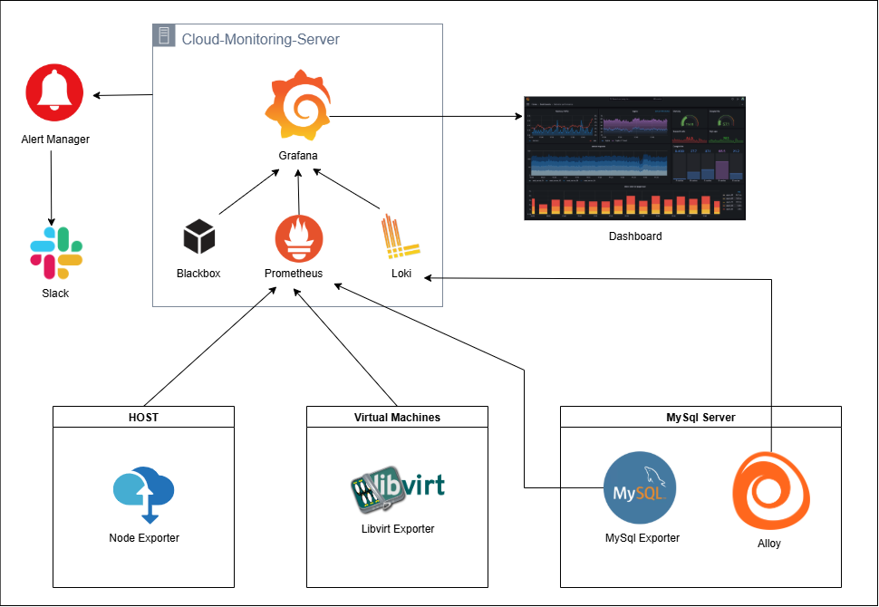

# Cloud Monitoring stack Architecture 



# Prometheus Installation
go to https://prometheus.io/download/ page now select Operating system and Architecture then copy the link address of (prometheus-xxxxxxxxxx.tar.gz)

### Create a System User for Prometheus
```
sudo su
groupadd --system prometheus
useradd --system --no-create-home --shell /sbin/nologin --gid prometheus prometheus
```
### Create Directories for Prometheus
```
mkdir /var/lib/Prometheus
```
###  Download Prometheus and Extract Files
```
wget https://github.com/prometheus/prometheus/releases/download/v2.53.4/prometheus-2.53.4.linux-amd64.tar.gz
tar xvf prometheus-2.53.4.linux-amd64.tar.gz
```
###  Move the Binary Files and Configuration Files
```
cd prometheus-2.53.4.linux-amd64
mv prometheus promtool /usr/local/bin
mv consoles console_libraries prometheus.yml /etc/Prometheus
```
### Create Prometheus Systemd Service
```
vi /etc/systemd/system/prometheus.service
```
```
[Unit]
Description=Prometheus
Documentation=https://prometheus.io/docs/introduction/overview/
Wants=network-online.target
After=network-online.target

[Service]
Type=simple
User=prometheus
Group=prometheus
ExecReload=/bin/kill -HUP $MAINPID
ExecStart=/usr/local/bin/prometheus \
  --config.file=/etc/prometheus/prometheus.yml \
  --storage.tsdb.path=/var/lib/prometheus \
  --web.console.templates=/etc/prometheus/consoles \
  --web.console.libraries=/etc/prometheus/console_libraries \
  --web.listen-address=0.0.0.0:9090 \
  --storage.tsdb.retention.time=30d

SyslogIdentifier=prometheus
Restart=always

[Install]
WantedBy=multi-user.target
EOF
```
### Give ownership and perminssion
```
chown -R prometheus:prometheus /etc/prometheus
chown -R prometheus:prometheus /etc/prometheus/*
chown prometheus:prometheus /usr/local/bin/prometheus
chown prometheus:prometheus /usr/local/bin/promtool
chown -R prometheus:prometheus /var/lib/prometheus
chmod -R 775 /etc/prometheus
chmod -R 775 /etc/prometheus/*
prometheus –version
```
### Reload systemd and Start prometheus
```
systemctl daemon-reload
systemctl start prometheus
systemctl enable prometheus
systemctl status prometheus
```
### Check Prometheus web console

With Prometheus running successfully, you can access it via your web browser using http://<host-ip\>:9090 or <ip_address>:9090

# Grafana Installation
### Download and unpack
```
apt-get install -y adduser libfontconfig1 musl
wget https://dl.grafana.com/oss/release/grafana_12.0.0_arm64.deb
dpkg -i grafana_12.0.0_arm64.deb
```
### Reload systemd and Start graafana
```
systemctl daemon-reload
systemctl start grafana-server
systemctl enable grafana-server
systemctl status grafana-server
```
### Check grafana web console
Check web http://<host-ip\>:3000 <br/>
you will be greated with grafana login page<br/>
default login credential<br/>
>username: admin <br/>
>password: admin <br/>

### Config Grafana
```
cd /etc/grafana
ls
cp grafana.ini grafana.ini.old
vi grafana.ini
# make changes if needed by default no needed!
systemctl stop grafana-server
systemctl start grafana-server
systemctl status grafana-server
```
### Add Prometheus as Data Source
Login to Grafana http://<host-ip\>:3000 <br/>

goto connection > data Sources > Add new Data source

* Select Prometheus
* Mention your Prometheus server URL
* Add Authentication if needed
* keep Manage alerts via Alerting UI under Altering ON
* Keep HTTP method > POST (recommended)

# Grafana Loki Installation
### Loki installation on Monitoring server
```
apt-get update
apt-get install loki
systemctl daemon-reload
systemctl start loki
systemctl enable loki
systemctl status loki
```
### Check Loki is receiving logs
```
curl http://localhost:3100/metrics
curl -G http://localhost:3100/loki/api/v1/labels
```

# Node Exporter Installation

Install Node Exporter if you want to collect hardware-level metrics (CPU, memory, disk, etc.) from a machine - Host/VM

Go to https://prometheus.io/download/ page now select your Operating system and Architecture then copy the link address of node_exporter(node_exporter-xxxxxxx.tar.gz) 

### Update & Upgrade and Create User
```
groupadd --system prometheus
useradd --system --no-create-home --shell /sbin/nologin --gid prometheus prometheus
```
### Download and unpack node_exporter
```
wget https://github.com/prometheus/node_exporter/releases/download/v1.9.1/node_exporter-1.9.1.linux-amd64.tar.gz
tar xvf node_exporter-1.9.1.linux-amd64.tar.gz
cd node_exporter-1.9.1.linux-amd64
ls
mkdir /var/lib/node/
ls
mv node_exporter /var/lib/node/
```
### Create node-exporter Systemd Service
```
vi /etc/systemd/system/node_exporter.service
```
```
[Unit]
Description=Node Exporter
Documentation=https://prometheus.io/docs/introduction/overview/
Wants=network-online.target
After=network-online.target

[Service]
Type=simple
User=prometheus
Group=prometheus
ExecReload=/bin/kill -HUP $MAINPID
ExecStart=/var/lib/node/node_exporter
SyslogIdentifier=prometheus_node_exporter
Restart=always

[Install]
WantedBy=multi-user.target
```
### Give ownership and perminssion
```
chown -R prometheus:prometheus /var/lib/node
chown -R prometheus:prometheus /var/lib/node/*
```
### Reload systemd and Start Node Exporter
```
systemctl daemon-reload
systemctl start node_exporter
systemctl enable node_exporter
systemctl status node_exporter
```
### Verify Node Exporter is Running
```
curl http://localhost:9100/metrics
```
### Clean Up
```
cd ..
rm -rf node_exporter-1.9.1.linux-amd64.tar.gz node_exporter-1.9.1.linux-amd64
```
### Configuring your Prometheus instances to access Node Exporter metrics
Log in to monitoring server(where prometheus installed)
```
cd /etc/promethetus/
vi prometheus.yml
```
```
global:
  scrape_interval: 15s

scrape_configs:
- job_name: 'node exporter'
  static_configs:
  - targets: ['localhost:9100']
  - targets: ['<host-ip>:9100']
  - targets: ['<VM's-ip>:9100']
```
### Reload services
```
systemctl daemon-reload
systemctl stop prometheus
systemctl start prometheus
systemctl status prometheus
```
### Check Prometheus web console

> http://<prometheus-vm-ip\>:9090/targets

Check for your endpoint and status of it.

# Libvirt Exporter Installation
Install Libvirt exporter on host which have hypervisor, and when we dont have permission to access the vm 

### Create User
```
groupadd --system prometheus
useradd --system --no-create-home --shell /sbin/nologin --gid prometheus prometheus
```
### Download and unpack Libvirt exporter
```
apt install -y git make golang libvirt-dev
wget https://github.com/Tinkoff/libvirt-exporter/archive/refs/tags/2.3.3.tar.gz
tar -xvzf 2.3.3.tar.gz
cd libvirt-exporter-2.3.3
go build -o libvirt-exporter .
mv libvirt-exporter /usr/local/bin/
```
### Create Libvirt-exporter Systemd Service
```
vi /etc/systemd/system/libvirt-exporter.service
```
```
[Unit]
Description=Libvirt Exporter
Wants=network-online.target
After=network-online.target

[Service]
User=prometheus
Group=prometheus
ExecStart=/usr/local/bin/libvirt-exporter --web.listen-address=:9177
Restart=always

[Install]
WantedBy=multi-user.target
```
### Reload systemd and Start Libvirt Exporter
```
systemctl daemon-reexec
systemctl daemon-reload
systemctl start libvirt-exporter
systemctl enable libvirt-exporter
systemctl status libvirt-exporter
```
### Verify Libvirt Exporter is Running
```
curl http://localhost:9177/metrics
```
### Clean Up
```
cd ..
rm -rf 2.3.3.tar.gz libvirt-exporter-2.3.3
```
### note:-
If service is not running properly try removing<br>

User=prometheus<br>
Group=prometheus

from etc/systemd/system/libvirt-exporter.service and restart the services

### Lists all running processes and systemd services
```
ps aux | grep exporter
systemctl list-units --type=service | grep exporter
```
### Configure Libvirt endpoint - on Prometheus server
```
cd /etc/promethetus/
vi prometheus.yml
```
```
global:
  scrape_interval: 15s

scrape_configs:
- job_name: 'Libvirt exporter'
  static_configs:
  - targets: ['<VM's-ip>:9100']
```
### Reload services
```
systemctl daemon-reload
systemctl stop prometheus
systemctl start prometheus
systemctl status prometheus
```
### Check Prometheus web console

> http://<prometheus-vm-ip\>:9090/targets

Check for your endpoint and status of it.

# Blackbox Exporter Installation

Go to https://prometheus.io/download/ page now select Operating system and Architecture then copy the link address of (blackbox_exporter-xxxxxxxx.tar.gz) 

### Download and extract the Blackbox binary
```
wget https://github.com/prometheus/blackbox_exporter/releases/download/v0.27.0/blackbox_exporter-0.27.0.linux-amd64.tar.gz
tar xvf blackbox_exporter-0.27.0.linux-amd64.tar.gz
cd blackbox_exporter-0.27.0.linux-amd64
mv blackbox_exporter /usr/local/bin/
chmod +x /usr/local/bin/blackbox_exporter
```
### Create Blackbox-exporter Systemd Service
```
vi /etc/systemd/system/blackbox_exporter.service
```
```
[Unit]
Description=blackbox_exporter
After=network-online.target
Wants=network-online.target

[Service]
# useradd -rs /bin/false blackbox
User=prometheus
Group=prometheus
ExecStart=/usr/local/bin/blackbox_exporter --config.file="/etc/prometheus/blackbox.yml"
Restart=on-failure

[Install]
WantedBy=multi-user.target
```
### Configure Blackbox Exporter
```
cd /etc/prometheus/
vi blackbox.yml
```
```
modules:
  http_2xx:
    prober: http
    timeout: 5s
    http:
      preferred_ip_protocol: "ip4"
      valid_http_versions: ["HTTP/1.1", "HTTP/2.0"]
      valid_status_codes: []  # Defaults to 2xx
      method: GET
```
### Start and Enable the Service
```
systemctl daemon-reload
systemctl start blackbox
systemctl enable blackbox
systemctl status blackbox
```
### Configure Prometheus to Use Blackbox Exporter
```
vi /etc/prometheus/prometheus.yml
```
```
 - job_name: 'blackbox'
    metrics_path: /probe
    params:
      module: [http_2xx]  # Look for a HTTP 200 response.
    static_configs:
      - targets:
        - https://prometheus.io/
        - https://grafana.com/
        - https://www.google.com/
        - https://abc.com/
    relabel_configs:
      - source_labels: [__address__]
        target_label: __param_target
      - source_labels: [__param_target]
        target_label: instance
      - target_label: __address__
        replacement: localhost:9115  # The blackbox exporter's real hostname:port.
```
```
systemctl restart prometheus
```
### Verify the Setup
```
curl http://<your_server_ip>:9115/metrics
```
### Check Prometheus web console

> http://<prometheus-vm-ip\>:9090/targets

Check for your endpoint and status of it.

# MySqld exporter Installation

### Add Prometheus system user and group
```
groupadd --system prometheus
useradd -s /sbin/nologin --system -g prometheus prometheus
``` 

### Download and install Prometheus mysqld_exporter

Go to https://prometheus.io/download/ page now select Operating system and Architecture then copy the link address of (mysqld_exporter-xxxxxxx.tar.gz) 
```
wget https://github.com/prometheus/mysqld_exporter/releases/download/v0.17.2/mysqld_exporter-0.17.2.linux-amd64.tar.gz
tar xvf mysqld_exporter-0.17.2.linux-amd64.tar.gz
cd mysqld_exporter-0.17.2.linux-amd64
mv mysqld_exporter /usr/local/bin/
chmod +x /usr/local/bin/mysqld_exporter
mysqld_exporter  --version
```
### Create Prometheus exporter database user
```
mysql -u root -p
```
The user should have PROCESS, SELECT, REPLICATION CLIENT grants:
```
mysql> CREATE USER 'mysqld_exporter'@'localhost' IDENTIFIED BY 'StrongPassword';
mysql> GRANT PROCESS, REPLICATION CLIENT, SELECT ON *.* TO 'mysqld_exporter'@'localhost';
mysql> FLUSH PRIVILEGES;
mysql> EXIT
```
If you have a Master-Slave database architecture, create user on the master servers only.

WITH MAX_USER_CONNECTIONS 2 is used to set a max connection limit for the user to avoid overloading the server with monitoring scrapes under heavy load.
Code language: PHP (php)

### Configure database credentials
```
vi /etc/.mysqld_exporter.cnf
```
Add correct username and password for user create
```
[client]
user=mysqld_exporter
password=StrongPassword
```
### Set ownership permissions:
```
chown root:prometheus /etc/.mysqld_exporter.cnf
```
### Create systemd unit file
```
vi /etc/systemd/system/mysql_exporter.service
```
```
[Unit]
Description=Prometheus MySQL Exporter
After=network.target
User=prometheus
Group=prometheus

[Service]
Type=simple
Restart=always
ExecStart=/usr/local/bin/mysqld_exporter \
--config.my-cnf /etc/.mysqld_exporter.cnf \
--collect.global_status \
--collect.info_schema.innodb_metrics \
--collect.auto_increment.columns \
--collect.info_schema.processlist \
--collect.binlog_size \
--collect.info_schema.tablestats \
--collect.global_variables \
--collect.info_schema.query_response_time \
--collect.info_schema.userstats \
--collect.info_schema.tables \
--collect.perf_schema.tablelocks \
--collect.perf_schema.file_events \
--collect.perf_schema.eventswaits \
--collect.perf_schema.indexiowaits \
--collect.perf_schema.tableiowaits \
--collect.slave_status \
--web.listen-address=0.0.0.0:9104

[Install]
WantedBy=multi-user.target
```
### Reload systemd and start mysql_exporter service
```
systemctl daemon-reload
systemctl start mysql_exporter
systemctl enable mysql_exporter
systemctl status mysql_exporter
```
### Verify Mysql Exporter is Running
```
curl http://localhost:9104/metrics
```
### Configure MySQL endpoint - on Prometheus server
```
vi /etc/prometheus/prometheus.yml
```
```
scrape_configs:
  - job_name: "mysqld_exporter"
    static_configs:
      - targets: ['<mysql-server-ip>:9104']
        labels:
          alias: test-db
```
### Reload systemd and Start prometheus
```
systemctl daemon-reload
systemctl restart prometheus
systemctl status prometheus
```   
### Check Prometheus web console

> http://<prometheus-vm-ip\>:9090/targets

Check for your endpoint and status of it.

# Grafana Alloy Installation 
```
apt install gpg
mkdir -p /etc/apt/keyrings/
wget -q -O - https://apt.grafana.com/gpg.key | gpg --dearmor | sudo tee /etc/apt/keyrings/grafana.gpg > /dev/null
echo "deb [signed-by=/etc/apt/keyrings/grafana.gpg] https://apt.grafana.com stable main" | sudo tee /etc/apt/sources.list.d/grafana.list
apt-get update
apt-get install alloy
```
### View Alloy Logs
```
journalctl -u alloy
```

### Configure Alloy - Expose the UI to other machines
```
vi /lib/systemd/system/alloy.service
```
```
[Unit]
Description= Vendor-agnostic OpenTelemetry Collector distribution with programmable pipelines
Documentation=https://grafana.com/docs/alloy
Wants=network-online.target
After=network-online.target

[Service]
Restart=always
User=alloy
Environment=HOSTNAME=%H
Environment=ALLOY_DEPLOY_MODE=deb
EnvironmentFile=/etc/default/alloy
WorkingDirectory=/var/lib/alloy
ExecStart=/usr/bin/alloy run $CUSTOM_ARGS --server.http.listen-addr=0.0.0.0:12345 --storage.path=/var/lib/alloy/data $CONFIG_FILE
ExecReload=/usr/bin/env kill -HUP $MAINPID
TimeoutStopSec=20s
SendSIGKILL=no

[Install]
WantedBy=multi-user.target
```
### Alloy config to Monitor logs from a local file with Grafana Alloy
```
vi /etc/alloy/config.alloy
```
```
local.file_match "local_files" {
     path_targets = [{"__path__" = "/var/log/mysql/error.log"}]
     sync_period = "5s"
 }

loki.write "grafana_loki" {
  endpoint {
    url = "http://<Loki-server-ip>:3100/loki/api/v1/push"
  }
}

loki.source.file "log_scrape" {
    targets    = local.file_match.local_files.targets
    forward_to = [loki.process.add_new_label.receiver]
  }

loki.process "add_new_label" {
  stage.logfmt {
      mapping = {
          "extracted_level" = "level",
          "extracted_logger" = "logger",
      }
  }
  stage.labels {
      values = {
          "level" = "extracted_level",
          "logger" = "extracted_logger",
      }
  }
    forward_to = [loki.write.grafana_loki.receiver]
}
```
### check network status of the alloy
```
sudo ss -lutp | grep alloy
```
### check Alloy UI
> go to browser > http://<alloy-server-ip\>:12345

###  Verify logs are being pushed to Loki
```
echo "Test log $(date)" >> /var/log/mysql/error.log
journalctl -u alloy -f
```
### Restart alloy service
```
systemctl start alloy
systemctl enable alloy.service
systemctl status alloy
```

# Add Loki as a Data Source in Grafana
* Open Grafana (http://<grafana-server-ip\>:3000)
* Go to Settings > Data Sources > Add Data Source
* Choose Loki
* Set URL as: http://<loki-server-ip\>:3100
* Save and test
* For Validation Use Grafana Explore to query > {filename="..."}